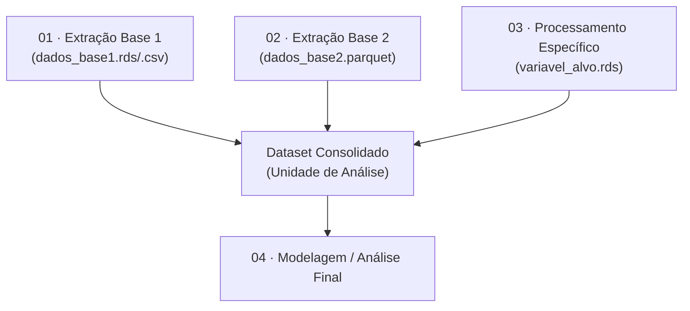

# Documentação de Bases de Dados e Reprodutibilidade

Este documento reúne a explicação de **cada base de dados** utilizada no pipeline de [Descreva o propósito do projeto], detalhando qual **script** a processa, os **arquivos de saída** gerados, e como cada uma se relaciona com a metodologia descrita no [Documento de Referência].

## Como ler este documento

A explicação de cada base de dados segue esta estrutura:
1. **O que é a base** — Explicação clara, sem jargões.
2. **Por que está no modelo** — Justificativa analítica ou teórica.
3. **De onde vem** — Fonte original ou sistema.
4. **Como é processada** — Resumo dos principais passos do script.
5. **Script e saída** — Rastreabilidade entre o código-fonte e o arquivo final.
6. **Reprodutibilidade** — Parâmetros sensíveis.

---

## Visão Geral do Pipeline

O pipeline segue um fluxo estruturado, da extração bruta até o dataset consolidado final.

> **Unidade de Análise:** A agregação final dos dados é feita no nível de [Ex: Hexágono H3 res 9].

---

## 01 · [Nome da Base Principal ou Unidade Base]

**O que é:** [Ex: A malha de hexágonos H3 que cobre a cidade].

**Por que está no modelo:** Serve como o "recipiente" comum para onde todas as outras fontes de dados serão agregadas.

**De onde vem:** [Fonte. Ex: Geração computacional via H3].

**Como é processada:**
1. [Ex: Filtro inicial da área de interesse].
2. [Ex: Limpeza de geometrias inválidas].

| | |
|---|---|
| **Script** | `01_extracao_base_principal.R` |
| **Saída** | `data/processed/base_principal.rds` |
| **Depende de** | [Nenhuma] |

**Reprodutibilidade:**
- **Parâmetro X (`var_x = 10`):** Qualquer alteração aqui muda a unidade base do projeto.

---

## 02 · [Nome da Base Secundária 1]

**O que é:** [Ex: Microdados do Censo 2022].

**Por que está no modelo:** [Ex: Corresponde às dimensões sociais e demográficas].

**De onde vem:** [Fonte detalhada].

**Como é processada:**
1. [Ex: Leitura dos dados particionados].
2. [Ex: Agregação para a Unidade de Análise].

| | |
|---|---|
| **Script** | `02_processamento_base_secundaria.R` |
| **Saída** | `data/processed/base_secundaria_1.rds` |
| **Usado por** | [Ex: Script 04 para criação do modelo] |

---

## Tabela-Resumo: Rastreabilidade de Fontes

| Base de Dados Original | Script Responsável | Arquivo de Saída (Processed) | Função / Dimensão no Projeto |
| :--- | :--- | :--- | :--- |
| [Base Bruta 1] | `01_script_1.R` | `base1_tratada.rds` | Unidade Base |
| [Base Bruta 2] | `02_script_2.R` | `base2_tratada.rds` | Variável Alvo |

---

## Checklist de Reprodutibilidade End-to-End

Para reconstruir o dataset consolidado a partir do zero:

1. Executar `01_script_1.R` — [Não depende de outros processamentos].
2. Executar `02_script_2.R` — [Depende de XYZ].
3. Executar `0X_merge_final.R` — Responsável por realizar os *joins* finais.

**Parâmetros globais constantes:**
- **Sistema de Coordenadas (CRS):** [Ex: EPSG:31983]
- **Limiares Definidos:** [Ex: threshold_classificacao = 0.70]
